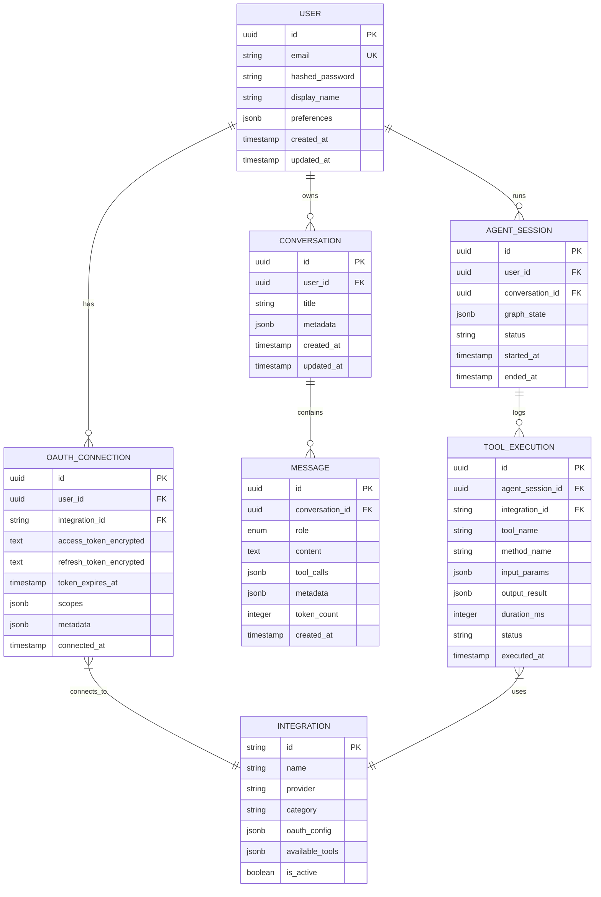
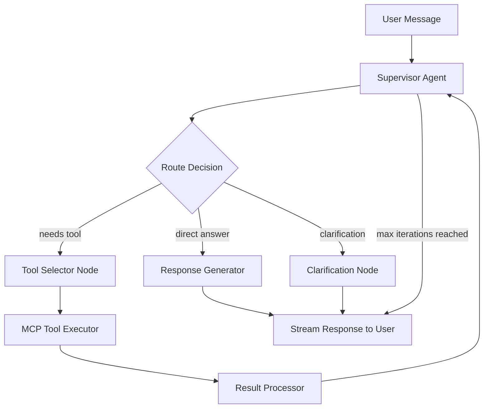

# NexFlow Backend — Architecture & Design Plan

## 1. Vision

NexFlow is a **multi-agent orchestration platform** where users connect their daily-use apps
(GitHub, LinkedIn, Google Workspace) via OAuth and interact with them through a unified
AI chatbot. The backend must be production-ready, scalable, and built on modern agent
infrastructure (LangGraph, MCP, A2A-ready).

---

## 2. High-Level Architecture

**Pattern:** Modular Monolith (single deployable, clean internal boundaries)
— right-sized for a resume project with few users, yet structured for future extraction
into microservices if needed.

```
┌─────────────────────────────────────────────────────────────────────┐
│                        React Frontend                                │
│             (existing — minimal changes needed)                      │
└───────────────┬─────────────────────────────────────────────────────┘
                │  REST + WebSocket (SSE for streaming)
                ▼
┌─────────────────────────────────────────────────────────────────────┐
│                     FastAPI Application                               │
│  ┌──────────┐  ┌──────────┐  ┌──────────┐  ┌──────────────────┐    │
│  │ Auth     │  │ Chat     │  │ Integr.  │  │ Health/Admin     │    │
│  │ Router   │  │ Router   │  │ Router   │  │ Router           │    │
│  └────┬─────┘  └────┬─────┘  └────┬─────┘  └──────────────────┘    │
│       │              │              │                                 │
│  ┌────▼──────────────▼──────────────▼──────────────────────────┐    │
│  │              Service Layer                                   │    │
│  │  ┌─────────┐ ┌──────────┐ ┌─────────────┐ ┌─────────────┐  │    │
│  │  │ Auth    │ │ Agent    │ │ Integration │ │ MCP Server  │  │    │
│  │  │ Service │ │ Orchestr.│ │ Service     │ │ Manager     │  │    │
│  │  └─────────┘ └──────────┘ └─────────────┘ └─────────────┘  │    │
│  └──────────────────┬──────────────────────────────────────────┘    │
│                     │                                                │
│  ┌──────────────────▼──────────────────────────────────────────┐    │
│  │             Infrastructure Layer                              │    │
│  │  ┌────────┐  ┌───────┐  ┌──────────┐  ┌─────────────────┐  │    │
│  │  │Postgres│  │ Redis │  │ LLM      │  │ OAuth Token     │  │    │
│  │  │  (DB)  │  │(Cache)│  │ Client   │  │ Vault           │  │    │
│  │  └────────┘  └───────┘  └──────────┘  └─────────────────┘  │    │
│  └─────────────────────────────────────────────────────────────┘    │
└─────────────────────────────────────────────────────────────────────┘
```

### Key Decisions

| Decision               | Choice                          | Rationale                                                    |
| ---------------------- | ------------------------------- | ------------------------------------------------------------ |
| Language               | Python 3.12+                    | Best LangGraph/LangChain ecosystem support                   |
| API Framework          | FastAPI                         | Async-native, Pydantic validation, auto OpenAPI docs         |
| Agent Orchestration    | LangGraph                       | Graph-based workflows, supervisor pattern, durable execution |
| Database               | PostgreSQL                      | Relational, JSONB for flexible agent state, battle-tested    |
| Cache / Sessions       | Redis                           | Token caching, rate limiting, session store, pub/sub         |
| LLM SDK                | OpenAI Python SDK               | Unified interface for OpenAI + OpenRouter                    |
| Auth                   | JWT (access+refresh) + OAuth2   | Stateless auth, OAuth for third-party integrations           |
| Deployment             | Render / Railway                | Persistent processes, WebSocket support, managed Postgres    |
| MCP                    | Custom MCP server manager       | Full control, no third-party dependency                      |

---

## 3. Domain Model



---

## 4. API Surface

### 4.1 Auth (`/api/v1/auth`)

| Method | Endpoint           | Description                      | Auth    |
| ------ | ------------------ | -------------------------------- | ------- |
| POST   | `/register`        | Create account (email+password)  | Public  |
| POST   | `/login`           | Get JWT access + refresh tokens  | Public  |
| POST   | `/refresh`         | Refresh access token             | Refresh |
| POST   | `/logout`          | Invalidate refresh token         | JWT     |
| GET    | `/me`              | Get current user profile         | JWT     |

### 4.2 Chat (`/api/v1/chat`)

| Method | Endpoint                  | Description                            | Auth |
| ------ | ------------------------- | -------------------------------------- | ---- |
| GET    | `/conversations`          | List user's conversations              | JWT  |
| POST   | `/conversations`          | Create new conversation                | JWT  |
| GET    | `/conversations/{id}`     | Get conversation with messages         | JWT  |
| DELETE | `/conversations/{id}`     | Delete conversation                    | JWT  |
| POST   | `/conversations/{id}/messages` | Send message (returns SSE stream) | JWT  |

**Streaming response format (SSE):**
```
event: thinking
data: {"step": "Selecting tool: github.list_repos"}

event: tool_call
data: {"tool": "github", "method": "list_repos", "status": "executing"}

event: tool_result
data: {"tool": "github", "method": "list_repos", "result": {...}}

event: token
data: {"content": "Here"}

event: token
data: {"content": " are"}

event: done
data: {"message_id": "uuid", "token_count": 142}
```

### 4.3 Integrations (`/api/v1/integrations`)

| Method | Endpoint                    | Description                              | Auth |
| ------ | --------------------------- | ---------------------------------------- | ---- |
| GET    | `/`                         | List all available integrations          | JWT  |
| GET    | `/connected`                | List user's connected integrations       | JWT  |
| GET    | `/{id}/oauth/authorize`     | Start OAuth flow (redirect URL)          | JWT  |
| GET    | `/{id}/oauth/callback`      | OAuth callback handler                   | -    |
| DELETE | `/{id}/disconnect`          | Revoke OAuth + delete connection         | JWT  |
| GET    | `/{id}/tools`               | List available tools for an integration  | JWT  |

### 4.4 Health / Admin (`/api/v1`)

| Method | Endpoint    | Description                    | Auth   |
| ------ | ----------- | ------------------------------ | ------ |
| GET    | `/health`   | Liveness check                 | Public |
| GET    | `/health/ready` | Readiness (DB + Redis + LLM) | Public |

---

## 5. Agent Orchestration (LangGraph)

### 5.1 Supervisor Pattern



### 5.2 Graph State

```python
class AgentState(TypedDict):
    messages: Annotated[list[BaseMessage], add_messages]
    user_id: str
    conversation_id: str
    available_tools: list[dict]       # user's connected integration tools
    current_plan: str | None          # supervisor's plan
    tool_calls: list[dict]            # executed tool calls in this turn
    iteration_count: int              # guard against infinite loops
    final_response: str | None
```

### 5.3 Key Design Choices

- **Max 5 tool calls per turn** to prevent runaway loops
- **Supervisor decides** which integration tool to call based on user's connected services
- **Tool results** are fed back to the supervisor for synthesis
- **Conversation memory** via PostgreSQL-backed checkpointer (LangGraph `PostgresSaver`)
- **Streaming** via SSE — each node transition emits events to the client

---

## 6. MCP Server Management

Instead of relying on Veyrax, we build our own lightweight MCP tool registry.

### 6.1 Architecture

```
┌─────────────────────────────────────────┐
│          MCP Tool Registry               │
│                                          │
│  ┌──────────────────────────────────┐   │
│  │  Integration Adapters             │   │
│  │  ┌────────┐ ┌────────┐          │   │
│  │  │ GitHub │ │LinkedIn│ ...      │   │
│  │  │Adapter │ │Adapter │          │   │
│  │  └───┬────┘ └───┬────┘          │   │
│  │      │          │                │   │
│  │  ┌───▼──────────▼────────────┐  │   │
│  │  │  Base MCP Tool Interface  │  │   │
│  │  │  - name, description      │  │   │
│  │  │  - input_schema (JSON)    │  │   │
│  │  │  - execute(params, token) │  │   │
│  │  └───────────────────────────┘  │   │
│  └──────────────────────────────────┘   │
└─────────────────────────────────────────┘
```

### 6.2 Tool Definition Format

Each integration adapter exposes tools in a standardized format:

```python
class MCPTool:
    name: str                   # e.g., "github.list_repos"
    description: str            # human-readable for LLM context
    integration_id: str         # e.g., "github"
    input_schema: dict          # JSON Schema for parameters
    requires_oauth: bool

    async def execute(self, params: dict, oauth_token: str) -> dict:
        ...
```

### 6.3 Integration Adapters (Priority Order)

| # | Integration      | OAuth Provider | Key Tools                                              |
| - | ---------------- | -------------- | ------------------------------------------------------ |
| 1 | GitHub           | GitHub OAuth   | list_repos, create_issue, list_prs, get_file, search   |
| 2 | Gmail            | Google OAuth   | list_emails, send_email, search_emails, read_email     |
| 3 | Google Calendar  | Google OAuth   | list_events, create_event, update_event, delete_event  |
| 4 | Google Drive     | Google OAuth   | list_files, search_files, upload_file, download_file   |
| 5 | Google Photos    | Google OAuth   | list_albums, search_photos, upload_photo               |
| 6 | LinkedIn         | LinkedIn OAuth | get_profile, create_post, get_connections              |

> **Note:** Google integrations share a single OAuth connection with different scopes.

---

## 7. LLM Service Layer

### 7.1 Unified Client

```python
class LLMClient:
    """
    Wraps OpenAI SDK. Supports both OpenAI and OpenRouter
    by simply swapping base_url and api_key.
    """
    def __init__(self, provider: str = "openai"):
        if provider == "openai":
            self.client = AsyncOpenAI(api_key=settings.OPENAI_API_KEY)
            self.default_model = "gpt-5-mini"
        elif provider == "openrouter":
            self.client = AsyncOpenAI(
                api_key=settings.OPENROUTER_API_KEY,
                base_url="https://openrouter.ai/api/v1"
            )
            self.default_model = settings.OPENROUTER_DEFAULT_MODEL

    async def chat(self, messages, tools=None, stream=False, model=None):
        return await self.client.chat.completions.create(
            model=model or self.default_model,
            messages=messages,
            tools=tools,
            stream=stream,
        )
```

---

## 8. Security & Auth

### 8.1 User Auth Flow

```
Register → bcrypt hash password → store in DB
Login    → verify password → issue JWT (access 15min + refresh 7d)
Refresh  → validate refresh token → issue new access token
```

- **JWT payload:** `{ sub: user_id, exp, iat, jti }`
- **Refresh tokens** stored in Redis with TTL (revocable)
- All passwords hashed with **bcrypt** (12 rounds)

### 8.2 OAuth Flow (Third-Party Integrations)

```
1. Frontend → GET /integrations/{id}/oauth/authorize
2. Backend generates state token (stored in Redis, 10min TTL)
3. Backend returns redirect URL to provider's OAuth consent page
4. User consents → provider redirects to callback URL
5. Backend exchanges code for tokens
6. Tokens encrypted (Fernet) and stored in oauth_connections table
7. Frontend redirected back to integrations page
```

### 8.3 Token Encryption

- OAuth tokens encrypted at rest using **Fernet symmetric encryption**
- Encryption key stored as environment variable (never in code/DB)
- Tokens decrypted only when making API calls, never exposed to frontend

---

## 9. Database Schema

```sql
-- Users
CREATE TABLE users (
    id UUID PRIMARY KEY DEFAULT gen_random_uuid(),
    email VARCHAR(255) UNIQUE NOT NULL,
    hashed_password VARCHAR(255) NOT NULL,
    display_name VARCHAR(100),
    preferences JSONB DEFAULT '{}',
    created_at TIMESTAMPTZ DEFAULT NOW(),
    updated_at TIMESTAMPTZ DEFAULT NOW()
);

-- Integrations (seeded, not user-created)
CREATE TABLE integrations (
    id VARCHAR(50) PRIMARY KEY,
    name VARCHAR(100) NOT NULL,
    provider VARCHAR(50) NOT NULL,
    category VARCHAR(50),
    oauth_config JSONB NOT NULL,
    available_tools JSONB DEFAULT '[]',
    is_active BOOLEAN DEFAULT TRUE
);

-- OAuth Connections (user ↔ integration)
CREATE TABLE oauth_connections (
    id UUID PRIMARY KEY DEFAULT gen_random_uuid(),
    user_id UUID NOT NULL REFERENCES users(id) ON DELETE CASCADE,
    integration_id VARCHAR(50) NOT NULL REFERENCES integrations(id),
    access_token_encrypted TEXT NOT NULL,
    refresh_token_encrypted TEXT,
    token_expires_at TIMESTAMPTZ,
    scopes JSONB DEFAULT '[]',
    metadata JSONB DEFAULT '{}',
    connected_at TIMESTAMPTZ DEFAULT NOW(),
    UNIQUE(user_id, integration_id)
);

-- Conversations
CREATE TABLE conversations (
    id UUID PRIMARY KEY DEFAULT gen_random_uuid(),
    user_id UUID NOT NULL REFERENCES users(id) ON DELETE CASCADE,
    title VARCHAR(255) DEFAULT 'New Conversation',
    metadata JSONB DEFAULT '{}',
    created_at TIMESTAMPTZ DEFAULT NOW(),
    updated_at TIMESTAMPTZ DEFAULT NOW()
);
CREATE INDEX idx_conversations_user ON conversations(user_id, updated_at DESC);

-- Messages
CREATE TABLE messages (
    id UUID PRIMARY KEY DEFAULT gen_random_uuid(),
    conversation_id UUID NOT NULL REFERENCES conversations(id) ON DELETE CASCADE,
    role VARCHAR(20) NOT NULL CHECK (role IN ('user', 'assistant', 'system', 'tool')),
    content TEXT,
    tool_calls JSONB,
    metadata JSONB DEFAULT '{}',
    token_count INTEGER DEFAULT 0,
    created_at TIMESTAMPTZ DEFAULT NOW()
);
CREATE INDEX idx_messages_conversation ON messages(conversation_id, created_at);

-- Agent Sessions
CREATE TABLE agent_sessions (
    id UUID PRIMARY KEY DEFAULT gen_random_uuid(),
    user_id UUID NOT NULL REFERENCES users(id) ON DELETE CASCADE,
    conversation_id UUID NOT NULL REFERENCES conversations(id) ON DELETE CASCADE,
    graph_state JSONB DEFAULT '{}',
    status VARCHAR(20) DEFAULT 'running' CHECK (status IN ('running', 'completed', 'failed', 'cancelled')),
    started_at TIMESTAMPTZ DEFAULT NOW(),
    ended_at TIMESTAMPTZ
);

-- Tool Executions
CREATE TABLE tool_executions (
    id UUID PRIMARY KEY DEFAULT gen_random_uuid(),
    agent_session_id UUID NOT NULL REFERENCES agent_sessions(id) ON DELETE CASCADE,
    integration_id VARCHAR(50) REFERENCES integrations(id),
    tool_name VARCHAR(100) NOT NULL,
    method_name VARCHAR(100) NOT NULL,
    input_params JSONB DEFAULT '{}',
    output_result JSONB,
    duration_ms INTEGER,
    status VARCHAR(20) DEFAULT 'pending' CHECK (status IN ('pending', 'running', 'success', 'error')),
    executed_at TIMESTAMPTZ DEFAULT NOW()
);
CREATE INDEX idx_tool_executions_session ON tool_executions(agent_session_id);
```

---

## 10. Redis Usage

| Use Case              | Key Pattern                          | TTL       |
| ---------------------- | ------------------------------------ | --------- |
| Refresh tokens         | `refresh:{jti}`                     | 7 days    |
| OAuth state tokens     | `oauth_state:{state}`              | 10 min    |
| Rate limiting          | `rate:{user_id}:{endpoint}`        | 1 min     |
| LLM response cache     | `llm_cache:{hash(messages)}`       | 1 hour    |
| User session metadata  | `session:{user_id}`                | 30 min    |
| Available tools cache  | `tools:{user_id}`                  | 5 min     |

---

## 11. Folder Structure

```
backend/
├── ARCHITECTURE.md            ← this file
├── alembic/                   ← DB migrations
│   ├── versions/
│   └── env.py
├── alembic.ini
├── requirements.txt
├── Dockerfile
├── docker-compose.yml         ← local dev (Postgres + Redis)
├── .env.example
├── main.py                    ← FastAPI app entry point
│
├── app/
│   ├── __init__.py
│   ├── config.py              ← pydantic Settings (env vars)
│   ├── database.py            ← async SQLAlchemy engine + session
│   ├── redis.py               ← Redis client setup
│   ├── dependencies.py        ← FastAPI dependency injection
│   │
│   ├── models/                ← SQLAlchemy ORM models
│   │   ├── __init__.py
│   │   ├── user.py
│   │   ├── integration.py
│   │   ├── oauth_connection.py
│   │   ├── conversation.py
│   │   ├── message.py
│   │   ├── agent_session.py
│   │   └── tool_execution.py
│   │
│   ├── schemas/               ← Pydantic request/response schemas
│   │   ├── __init__.py
│   │   ├── auth.py
│   │   ├── chat.py
│   │   ├── integration.py
│   │   └── common.py
│   │
│   ├── routers/               ← FastAPI routers (thin controllers)
│   │   ├── __init__.py
│   │   ├── auth.py
│   │   ├── chat.py
│   │   ├── integrations.py
│   │   └── health.py
│   │
│   ├── services/              ← Business logic
│   │   ├── __init__.py
│   │   ├── auth_service.py
│   │   ├── chat_service.py
│   │   ├── integration_service.py
│   │   └── llm_client.py
│   │
│   ├── agents/                ← LangGraph agent definitions
│   │   ├── __init__.py
│   │   ├── supervisor.py      ← main supervisor graph
│   │   ├── nodes/
│   │   │   ├── __init__.py
│   │   │   ├── planner.py
│   │   │   ├── tool_selector.py
│   │   │   ├── tool_executor.py
│   │   │   └── response_generator.py
│   │   └── state.py           ← AgentState definition
│   │
│   ├── mcp/                   ← MCP tool registry + adapters
│   │   ├── __init__.py
│   │   ├── registry.py        ← tool discovery + routing
│   │   ├── base.py            ← BaseMCPTool abstract class
│   │   └── adapters/
│   │       ├── __init__.py
│   │       ├── github.py
│   │       ├── gmail.py
│   │       ├── google_calendar.py
│   │       ├── google_drive.py
│   │       ├── google_photos.py
│   │       └── linkedin.py
│   │
│   ├── middleware/
│   │   ├── __init__.py
│   │   ├── cors.py
│   │   ├── rate_limiter.py
│   │   └── error_handler.py
│   │
│   └── utils/
│       ├── __init__.py
│       ├── crypto.py          ← Fernet encrypt/decrypt for tokens
│       ├── logger.py          ← structured logging setup
│       └── correlation.py     ← request correlation ID middleware
```

---

## 12. Cross-Cutting Concerns

### 12.1 Structured Logging

```python
# format: JSON lines
{
    "timestamp": "2026-02-24T10:00:00Z",
    "level": "INFO",
    "correlation_id": "req-abc-123",
    "user_id": "uuid",
    "message": "Tool executed",
    "extra": { "tool": "github.list_repos", "duration_ms": 342 }
}
```

### 12.2 Error Response Format (RFC 7807)

```json
{
    "type": "https://nexflow.app/errors/invalid-token",
    "title": "Invalid OAuth Token",
    "status": 401,
    "detail": "The GitHub access token has expired. Please reconnect.",
    "instance": "/api/v1/chat/conversations/abc/messages",
    "correlation_id": "req-abc-123"
}
```

### 12.3 Rate Limiting

- **Chat messages:** 30 requests/min per user
- **Auth endpoints:** 5 requests/min per IP
- **Tool executions:** 60 requests/min per user
- Implemented via Redis sliding window counter

### 12.4 Graceful Shutdown

- On SIGTERM: stop accepting new requests
- Wait for in-flight agent sessions to reach a checkpoint
- Close DB pool, Redis connections
- Exit cleanly

---

## 13. A2A Readiness

The architecture is designed to be **A2A-protocol ready** without implementing it day one:

- Each integration adapter can be exposed as an **A2A Agent Card** (JSON capability descriptor)
- The supervisor agent can act as an A2A client, discovering and delegating to remote agents
- Communication uses JSON-RPC 2.0 over HTTP — same transport A2A uses
- **Phase 2 consideration** — not in MVP scope

---

## 14. Deployment Strategy

### 14.1 Target: Render

```yaml
# render.yaml
services:
  - type: web
    name: nexflow-api
    runtime: python
    buildCommand: pip install -r requirements.txt
    startCommand: uvicorn main:app --host 0.0.0.0 --port $PORT
    envVars:
      - key: DATABASE_URL
        fromDatabase:
          name: nexflow-db
          property: connectionString
      - key: REDIS_URL
        fromService:
          type: redis
          name: nexflow-redis
          property: connectionString

databases:
  - name: nexflow-db
    plan: starter

services:
  - type: redis
    name: nexflow-redis
    plan: starter
```

### 14.2 Environment Variables

```
DATABASE_URL=postgresql+asyncpg://...
REDIS_URL=redis://...
SECRET_KEY=<random-64-char>
FERNET_KEY=<fernet-generated-key>
OPENAI_API_KEY=sk-...
OPENROUTER_API_KEY=sk-or-...
OPENROUTER_DEFAULT_MODEL=anthropic/claude-3.5-sonnet
GITHUB_CLIENT_ID=...
GITHUB_CLIENT_SECRET=...
GOOGLE_CLIENT_ID=...
GOOGLE_CLIENT_SECRET=...
LINKEDIN_CLIENT_ID=...
LINKEDIN_CLIENT_SECRET=...
FRONTEND_URL=https://nexflow.vercel.app
ALLOWED_ORIGINS=https://nexflow.vercel.app,http://localhost:3000
```

---

## 15. Dependencies (`requirements.txt`)

```
# Core
fastapi>=0.115.0
uvicorn[standard]>=0.30.0
pydantic>=2.9.0
pydantic-settings>=2.5.0

# Database
sqlalchemy[asyncio]>=2.0.35
asyncpg>=0.30.0
alembic>=1.14.0

# Redis
redis[hiredis]>=5.2.0

# Auth
python-jose[cryptography]>=3.3.0
passlib[bcrypt]>=1.7.4
cryptography>=43.0.0

# LLM / Agents
openai>=1.55.0
langgraph>=0.2.0
langchain-core>=0.3.0
langchain-openai>=0.2.0

# HTTP / OAuth
httpx>=0.27.0
authlib>=1.3.0

# Utilities
python-dotenv>=1.0.0
structlog>=24.4.0
python-multipart>=0.0.12
```

---

## 16. Risks & Trade-offs

| Risk                                    | Mitigation                                              |
| --------------------------------------- | ------------------------------------------------------- |
| LangGraph learning curve                | Start with simple supervisor, iterate                   |
| OAuth token management complexity       | Fernet encryption + auto-refresh on expiry              |
| Google OAuth scope creep (many services) | Single OAuth flow with progressive scope consent        |
| LinkedIn API restrictions               | Limited API access; focus on profile + posts            |
| LLM hallucinating tool calls            | Strict JSON schema validation + max iteration guard     |
| Cold start latency                      | Redis cache for tool registry + connection pooling      |
| Agent infinite loops                    | Max 5 tool calls per turn + timeout per node            |

---

## 17. Implementation Order

| Phase | What                                              | Priority |
| ----- | ------------------------------------------------- | -------- |
| 1     | Project scaffold + config + DB + Redis            | P0       |
| 2     | Auth system (register, login, JWT, refresh)       | P0       |
| 3     | LLM client (OpenAI + OpenRouter)                  | P0       |
| 4     | MCP base + GitHub adapter                         | P0       |
| 5     | LangGraph supervisor agent                        | P0       |
| 6     | Chat router + SSE streaming                       | P0       |
| 7     | OAuth flow + Google adapters                      | P1       |
| 8     | LinkedIn adapter                                  | P1       |
| 9     | Rate limiting + structured logging                | P1       |
| 10    | Dockerfile + Render deployment config             | P2       |

---

> Architecture & design ready.
> Reply **"APPROVED – start coding"** (or request changes).
> I will not write any implementation code before explicit approval.
